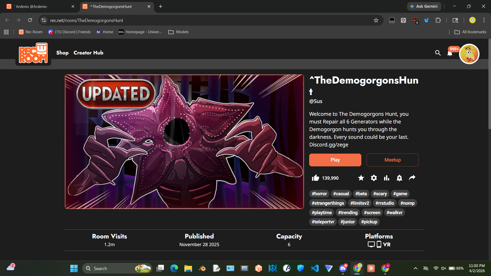
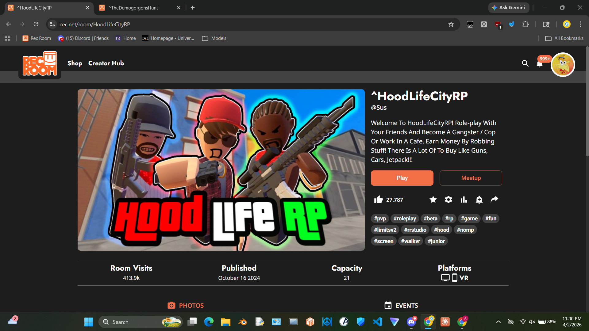
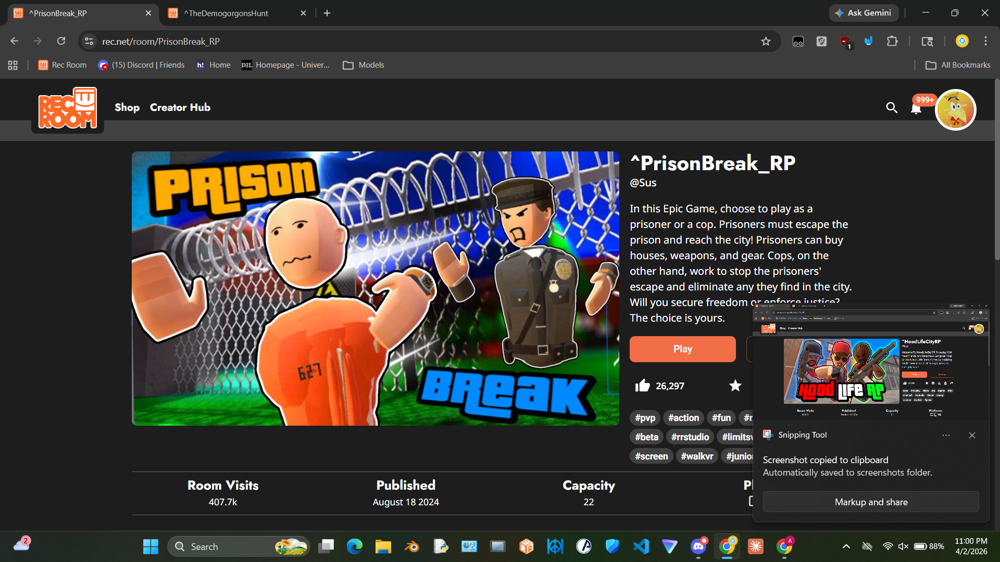
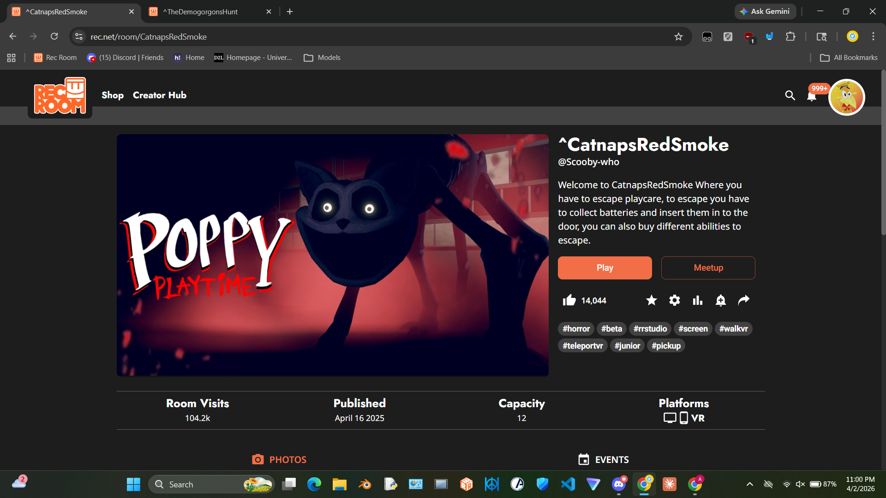

# Rec Room Game Development Portfolio

Games I designed and built in Rec Room's creator platform, archived here following the platform's shutdown. Rec Room used a visual scripting/component system (CRR / RR nodes) for game logic, similar to a lightweight engine scripting environment.

Combined, these rooms reached **~2.1M room visits** and **~208K likes** across ~4 years of active development.

## 🧰 Tech / Tools

> _TODO: list the actual tools — e.g. Rec Room Studio, CRR (visual scripting), custom modules, any external tools (Blender for models, Photoshop for cover art, etc.)_

## 📊 Skills Demonstrated

> _TODO: e.g. game state management, multiplayer sync, economy/currency systems, AI/NPC behavior, UI/UX design, level design_

---

## Table of Contents
- [The Demogorgon's Hunt](#-the-demogorgons-hunt)
- [HoodLife City RP](#-hoodlife-city-rp)
- [Prison Break RP](#-prison-break-rp)
- [Catnaps Red Smoke](#-catnaps-red-smoke)

---

## 🩸 The Demogorgon's Hunt

Horror survival game — repair all 6 generators while a Demogorgon hunts you through the dark. Every sound could be your last.

| Stat | Value |
|---|---|
| Likes | 139,990 |
| Room Visits | 1.2M |
| Published | November 28, 2025 |
| Capacity | 6 players |
| Platforms | Desktop, Mobile, VR |
| Tags | `#horror` `#casual` `#beta` `#scary` `#strangerthings` `#trending` |

**My Contributions:**
> _TODO: e.g. generator repair mini-games, Demogorgon AI/hunting logic, sound-detection system, lighting/atmosphere setup_

**Gameplay:**

---

## 🔫 HoodLife City RP

GTA-style open-world roleplay — play as a gangster, cop, or work a café job. Earn money, buy guns, cars, and jetpacks.

| Stat | Value |
|---|---|
| Likes | 27,787 |
| Room Visits | 413.9K |
| Published | October 16, 2024 |
| Capacity | 21 players |
| Platforms | Desktop, Mobile, VR |
| Tags | `#pvp` `#roleplay` `#rp` `#fun` `#hood` |

**My Contributions:**
> _TODO: e.g. economy/currency system, job system (cop/civilian/criminal), weapon/vehicle shop, robbery mechanics_

**Gameplay:**

---

## 🚔 Prison Break RP

Asymmetric multiplayer — play as a prisoner escaping or a cop enforcing order. Prisoners buy houses, weapons, and gear to survive in the city; cops hunt them down.

| Stat | Value |
|---|---|
| Likes | 26,297 |
| Room Visits | 407.7K |
| Published | August 18, 2024 |
| Capacity | 22 players |
| Platforms | Desktop, Mobile, VR |
| Tags | `#pvp` `#action` `#fun` `#beta` |

**My Contributions:**
> _TODO: e.g. escape mechanics, cop/prisoner role system, purchasable gear/houses, city map design_

**Gameplay:**

---

## 😼 Catnaps Red Smoke

Poppy Playtime-inspired horror escape room — collect batteries and insert them into the door to escape, or buy abilities to help you get out.

| Stat | Value |
|---|---|
| Likes | 14,044 |
| Room Visits | 104.2K |
| Published | April 16, 2025 |
| Capacity | 12 players |
| Platforms | Desktop, Mobile, VR |
| Tags | `#horror` `#beta` `#pickup` |

**My Contributions:**
> _TODO: e.g. battery collection/insertion puzzle, ability shop, Catnap AI chase logic_

**Gameplay:**

---
